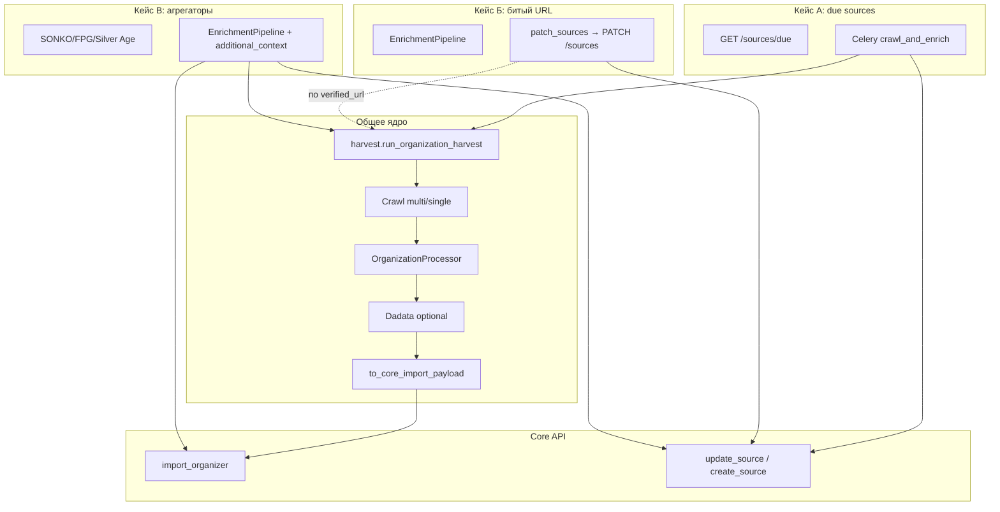

# Схема потоков обогащения: кейсы А, Б, В

**Дата:** 2026-02-25  
**Источник истины:** [docs/Navigator_Core_Model_and_API.md](../../../docs/Navigator_Core_Model_and_API.md), [2026-02-25__harvester-architecture-review-and-refactoring-plan.md](reports/2026-02-25__harvester-architecture-review-and-refactoring-plan.md)

Три основных сценария работы Harvester с организациями и источниками. Во всех случаях после получения URL и контекста обогащение сходится к **общему ядру** `harvest.run_organization_harvest` и далее к Core API (import/organizer, PATCH source).

---

## Кейс А: Организация в базе, корректный источник `org_website`

- **Триггер:** Плановый обход по расписанию (due sources).
- **Вход:** Список источников к обходу из Core: `GET /api/internal/sources/due?limit=100`.
- **Поток:**
  1. Laravel Scheduler (или внешний оркестратор) вызывает Core → получает due sources.
  2. Для каждого источника: `url = base_url`, `source_id`, `organizer_id` (existing_entity_id).
  3. Harvester: задача `crawl_and_enrich` (Celery) → `_run_pipeline` → **`run_organization_harvest`** (crawl → classify → Dadata → payload).
  4. Core: `import_organizer(payload)`, затем **`update_source(source_id, last_status, last_crawled_at)`**.
- **Где расходится:** Только точка входа (due API + Celery). Дальше — общее ядро harvest.

---

## Кейс Б: Организация в базе, источник битый (URL недоступен)

- **Триггер:** Ручной/скриптовый прогон по списку организаций с битыми URL (например, 171 источник).
- **Вход:** Список организаций с `source_id` и старым URL; результат поиска/верификации (новый `verified_url`).
- **Поток:**
  1. EnrichmentPipeline (поиск + верификация) находит новый URL.
  2. **`run_organization_harvest`** по `verified_url` (внутри `EnrichmentPipeline._run_full_harvest`).
  3. Результат пишется в JSON; применение к БД — через **`patch_sources.py`** → **Core API** `PATCH /api/internal/sources/{id}` (base_url, last_status, last_crawled_at). Раньше — прямой psycopg2; сейчас только API.
- **Где расходится:** Точка входа (EnrichmentPipeline + ручной/скриптовый запуск) и способ применения изменений (patch_sources через PATCH). Ядро harvest — то же.

---

## Кейс В: Организацию нужно получить из агрегатора (СО НКО, ФПГ, Silver Age)

- **Триггер:** Импорт из реестров/агрегаторов (SONKO, FPG, Silver Age).
- **Вход:** Записи из агрегатора (название, ИНН, описание практик и т.д.); часто без готового URL сайта.
- **Поток:**
  1. Агрегатор (скрипт/пайп) ищет сайт/соцсети (поиск + верификация), формирует `additional_context` (описания практик, грантов и т.д.).
  2. При нахождении URL: **`run_organization_harvest`** с `additional_context=...`, `try_site_extractor=True` (внутри `EnrichmentPipeline._run_full_harvest`).
  3. Core: `import_organizer`; при создании новой организации — при необходимости `create_source` (AUTO tier).
- **Где расходится:** Точка входа (агрегаторы, другой формат входных данных и контекста). Ядро harvest — общее; контекст передаётся в `run_organization_harvest`.

---

## Схема сходимости

- **Общее ядро:** один модуль `harvest.run_organization_harvest` используется в:
  - `workers.tasks._run_pipeline` (кейс А),
  - `search.enrichment_pipeline.EnrichmentPipeline._run_full_harvest` (кейсы Б и В),
  - `scripts.run_single_url` (CLI).
- **Обновление источника:** после краула в кейсе А — `update_source(source_id, last_status, last_crawled_at)` в tasks; в кейсе Б — через `patch_sources.py` → PATCH /sources.

---

## Файлы

| Компонент | Путь |
|-----------|------|
| Общее ядро harvest (организации) | `harvest/run_organization_harvest.py` |
| Celery pipeline (А) | `workers/tasks.py` → `_run_pipeline` |
| Enrichment + full harvest (Б, В) | `search/enrichment_pipeline.py` → `_run_full_harvest` |
| CLI один URL | `scripts/run_single_url.py` → `run()` |
| Патч источников по API (Б) | `scripts/patch_sources.py` |
| Политика «когда собирать события» | `harvest/event_harvest_policy.py` → `should_run_event_harvest_separately()` |
| Пайплайн приёма мероприятий | `event_ingestion/` → `run_event_ingestion_pipeline()`; адаптеры в `event_ingestion/adapters.py` |
| Задача сбора событий с сайта | `workers/tasks.py` → `harvest_events`, `_run_event_pipeline` |

---

## События (events): отдельный проход и единый пайплайн

**Когда запускать отдельный проход по мероприятиям** — решает политика: только для источников-агрегаторов мероприятий (афиша, Silver Age события и т.п.); для обычного сайта организации — не запускать отдельно, если события уже собраны в том же проходе. Подробно: [event-harvest-policy.md](event-harvest-policy.md). В коде: `harvest.event_harvest_policy.should_run_event_harvest_separately(source_kind, ...)`.

**Как обрабатываются мероприятия**, когда проход запущен (или события найдены в рамках обхода): все источники приводят данные к каноническому формату и проходят через [универсальный пайплайн приёма мероприятий](event_ingestion_pipeline.md) (RawEventInput → парсинг дат → EventProcessor → payload для Core). Точки входа: задача `harvest_events` (сайт организации, event discovery), агрегатор Silver Age, скрипт `import_silverage_events`.

---

## Связанные документы

| Документ | О чём |
|----------|--------|
| [event-harvest-policy.md](event-harvest-policy.md) | Когда запускать отдельный сбор мероприятий (политика). |
| [event_ingestion_pipeline.md](event_ingestion_pipeline.md) | Как обрабатываются мероприятия: канонический вход, пайплайн, адаптеры. |
| [aggregators_guide.md](aggregators_guide.md) | Агрегаторы ФПГ, СО НКО, Silver Age; общий поток и мероприятия. |
